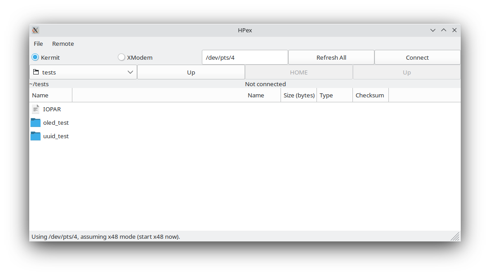

# hpex
HPex (pronounced "h-pecks", short for "HP Exchange") is a HP 48 to
Linux transfer tool with graphical and command line interfaces and
features found in no other Linux<->HP 48 transfer tool.

This is a manual describing HPex's features and how to use them. I've
tried to make it as simple as possible, but watch out for things
marked **Important:**, as well as those marked in bold. These are
pitfalls and possible areas of confusion.

# System Requirements
**Important:** HPex is designed to run on Linux. It will probably work
on Mac (though you should use
[Hoppi](https://bitbucket.org/pdo/hoppi2) there), and I'm sure it
won't work on Windows.

Because the HP 48's main communication system is Kermit, you'll need
Kermit on your computer. I built HPex around C-Kermit 9.0, and it's
readily available in both binary and source forms at [Columbia's
Kermit site](http://www.columbia.edu/kermit/ck90.html#download), and
probably in your distro's package manager too. The only other
requirement that can't be installed through pip is
[wxPython](https://wxpython.org/). I'm not going to explain how to
install this, because it's highly distro-dependent. That said, it is
present in many distros' package repositories.

Note that if you don't want to use HPex's GUI and want to use only the
command-line interface, you don't actually need wxPython. However, all
the other dependencies are still needed.

Those other requirements are:

1. [xmodem](https://pypi.org/project/xmodem/)
2. [PyPubSub](https://pypi.org/project/PyPubSub/) (note that this is different from [pubsub](https://pypi.org/project/pubsub/))
3. [ptyprocess](https://pypi.org/project/ptyprocess/)
4. [pyserial](https://pypi.org/project/pyserial/)

These can be installed in one shot with `sudo pip3 install xmodem
PyPubSub ptyprocess pyserial`.

To install HPex itself, make the `hpex.py` file executable, place the
whole directory in a convenient location, and add that directory to
your `$PATH`. HPex will run just fine. You can also rename `hpex.py`
to something else, like just `hpex`, if you prefer.

Finally, you'll need a calculator. **Important:** I only have an HP
48GX, so I cannot confirm whether HPex works with a 49G, 49g+, or a
50g, or any other RPL machines with serial support (though it should
be a given that a 48S/SX would work just fine).

HPex's GUI has support for both 15360 and 115200 baud transfers, to
make use of the features of the newer models.

# Advantages over other tools
## HPTalx
HPTalx is the main other program that provides similar features to
HPex, and it has a number of shortcomings:

1. No XModem support
2. Lack of threading means HPTalx hangs on almost every operation
3. Old, confusing interface in outdated framework (GTK2)
4. Poor support for USB serial ports

## Raw Kermit
1. XModem support, but Kermit needs a lot of configuration to work
   with the HP 48
2. Command line interface but a lot of typing for a single file
   transfer
3. Also somewhat-old interface

To be fair, HPex isn't perfect either, but it fulfills my needs and
hopefully works for you too.

# Using HPex's GUI
When you start HPex without any arguments on the command line, it
launches into GUI mode. This interface is relatively intuitive, except
for one special thing I'll discuss in just a moment.

In the first row of widgets beneath the window, you'll see:
- the mode radiobuttons, which switch between Kermit and XModem
- the serial port box, which contains the port HPex is currently
  operating on
- the "Refresh All" and "Connect" buttons

Beneath there, you'll see four buttons:
- one that has the directory you started HPex from (this is actually a
  directory chooser)
- an "Up" button
- a pair of disabled "HOME" and "Up" buttons.

Then, there's a row with two labels, one that shows the same directory
as the chooser above it, and one that says "Not connected".

Finally, there are two listboxes (the one on the left has the files in
the directory above it), and a statusbox beneath those two.

## Finding a serial port
When you start HPex, it begins a search in `/dev` for serial ports it
can use, following these steps:

1. Look for any device files named `ttyUSB*`, which is Linux's default
   device name for USB-to-serial adapters. Note that there is no
   support for [`ttyACM*`
   adapters](https://rfc1149.net/blog/2013/03/05/what-is-the-difference-between-devttyusbx-and-devttyacmx/).
   If HPex finds multiple `ttyUSB*` files, it uses the first one.
   
2. If no `ttyUSB` ports are found, then HPex searches for ports in
   `/dev/pts/`, the directory that holds pseudoterminal files. `x48`,
   the excellent HP 48 emulator for Linux, creates device files in
   this directory for its serial ports, as does your terminal emulator
   (Konsole, xterm, and others). Files in this directory are device
   files named with numbers, and HPex looks for "empty spaces." For
   example:
   
   `/dev/pts/` contains five files: `0`, `1`, `2`, `3`, and `5`. The
   empty space is between `3` and `5`. HPex recognizes this, and uses
   `/dev/pts/4` as the serial port. Why? `x48` uses a search method
   basically identical, and scanning for ports this way means HPex
   typically does a good job of finding the port that x48 will use.
   
   You'll notice this in the statusbar in the picture above. HPex
   tells you that it found `/dev/pts/4`, and also tells you to start
   `x48`. Sure enough, we start it, and...
   
   
   
   we clearly see that the emulator, sure enough, has chosen
   `/dev/pts/4` as the Wire serial port. **Important:** Make sure you
   start `x48` *after* starting HPex, otherwise HPex won't be able to
   find the empty space.
   
3. Finally, if no empty spaces are found, the highest-numbered
   `/dev/pts/` port is chosen.

The serial port box is also just a standard entry box, and you can
type any port you want to use.

## Transferring data with Kermit
Now that HPex has a valid serial port to use, we have to "connect" to
the HP 48 to the computer before we transfer any data. (This is an
idea inherited from HPTalx.) **Important:** Make sure the calculator is set to
translate mode 3. This will prevent issues with 7-bit and 8-bit
ASCII, as well as wxPython crashing with Unicode errors.

Press "Connect", and a little dialog will come up informing you of
Kermit's ongoing process. Once it's finished, HPex should look like
this:

Note that the widgets on the right side are no longer disabled, and
there's a lot more information. In the directory row, HPex tells you
what directory the calculator is currently in and how much memory is
in user memory (Port 0). In the picture, the calculator is in HOME,
with 145988.5 bytes free in Port 0.

Beneath that is a file list similar to the one on the left. Each
variable in the calculator's current directory is listed with its
name, size, type, and checksum.

#### Copying from the HP to the computer
Before you start, make sure both the calculator and the computer are
set to the right directory. The "HOME" button sets the calculator the
HOME directory, and "Up" is equivalent to running UPDIR on the
calculator.

To copy a variable from the calculator, start by double-clicking a
variable in the file listbox on the right. A window like this will
appear:

HPex tells you about the current connection and the file you want to
copy in this new window, which I'll call the "copy window". Kermit
will place the file in the directory specified on the left side of
HPex. 

Press "Copy" in the copy window to start. Unfortunately, the HP 48's
Kermit implementation doesn't send progress packets when it's sending
a file, so the progress indicator in the copy window just says "not
available when receiving". You can cancel with the "Cancel" button
when a copy operation is in progress.

If there's already a file with the name of the variable you're
copying, an dialog will appear asking what you want to do.

**Important:** to change directories on the calculator, *single-click*
a directory to select it (like 'TOOLS' in the above example), and
press one of _Delete_, _Backspace_, or _Tab_. HPex will change
directories and update the calculator's variable list. Unfortunately,
this is the only part of HPex's interface that I feel isn't as
intuitive as it should be. It's only implemented this way because
wxPython doesn't cooperate well with right-clicking an element in a
listbox (you can try it; it causes multiple items to be selected).

#### Copying from the computer to the HP
The steps for a Kermit copy are simple, similar to the previous
example. To change directories on the computer's side, you can do one
of two things:

1. Double-click a directory (labeled with a folder icon) in the
   listbox.
2. Use the directory chooser above the box (next to the "Up" button)
   to choose any directory.
3. Press the "Up" button to move up one directory level.

Just like before, double-click on a file to open the copy
window. You'll see that there are significantly more options in the
window to send *to* the calculator:

Again, HPex informs you of the file and the port. However, it also
tries to identify whether the file you want to send is in HP ASCII
format (`%%HP: ...`) or HP binary format (`HPHP48-R`). If the file is
in ASCII format, like in the example above, HPex tells you the
translate mode it was sent in, the angle mode, and the fraction
mode. If the file is binary (see below), HPex finds the object
size---which includes the filename---and the checksum, for verifying a
transfer.

**Important:** while the code that generates the object checksum and
size is my own, the actual binary math and overall routine **IS NOT
MINE**. It's my C->Python conversion of version 2.52 of Jonathan
Higa's `TASC` program from [Joe Horn's Goodies Disk
\#7](https://www.hpcalc.org/hp48/compilations/horn/horn7.zip). You can
see the modified C code from `TASC` in `ckfinder_old.c`.

Finally, let's finish copying the file. You can choose to make Kermit
rename the file on the calculator to something else, but by default,
HPex assumes you want no change and autofills the "Rename on
calculator:" box. When you start copying the file, the progress bar
fills until an error occurs or the copy finishes:

#### Transferring data with XModem
For the time being, XModem is only available as a send feature, i.e.,
you can only send files to the calculator and not vice versa. To
activate it, just click the "XModem" radiobutton. Make sure the port
you want to use is correct, choose a local directory, and double-click
a file you want to send. The copy window appears, this time without
the "Rename on calculator:" box, and you can start a
transfer. **Important:** if you've used raw Kermit in XModem mode,
using HPex with XModem is nearly identical. You have to prepare the
calculator with a name in level 1 and be ready to press or type XRECV
before HPex times out, like this (the file we want to copy is
`'TD2'`):

Then, press "Copy" in the copy window. HPex tells you to run XRECV on
the calculator, and once you do, the progress bar will start filling
just like it does for a Kermit transfer.

## Settings

HPex is quite configurable, and the main way to do this is through the
Settings dialog, accessible through the File menu. The options are as
follows:

- **Startup directory:** the directory HPex will initialize the
  left-hand file list in this directory.
- **Kermit name:** the name for the Kermit executable. If installed
  from your distro's repository, this is probably `ckermit`, but if
  you built Kermit from source, it's probably `kermit`.
- **Baud rate:** this has the four options available on an HP 48, as
  well as 15360 and 115200 for compatibility with the HP 49 and 50.
- **Parity:** serial port parity, used by both XModem and Kermit.
- **Kermit file mode:** either Auto, Binary, or ASCII. I leave this in
  Auto and adjust the calculator to how I want files transferred, as
  Kermit seems very smart about figuring it out.
- **Kermit checksum mode:** 1, 2, or 3.
- **Disable pty search, look only for ttyUSB ports:** checking this
  box will prevent HPex from trying to load any ports from
  `/dev/pts/`, and look only for `/dev/ttyUSB*` ports. **Important:** If no
  ports are found, the serial port box will be empty and you will have
  to fill in a port yourself.
- **Disconnect the calculator on close if connected:** this will
  finish the remote Kermit server if HPex is connected and you decide
  to close it.
- **Reset calculator directory on disconnect:** if this box is
  checked, HPex will remember the directory the calculator was set to
  *when it connected*, and will restore that directory on disconnect.
- **Ask to or warn about overwriting:** this box controls the
  generation of dialogs that warn you or let you control overwriting
  of files.

All settings are stored in the file `~/.hpexrc`. This file is not
human-editable (it's a serialized object created with Python's
`pickle` module), however, it can be backed up and restored like any
other configuration file.

## Extra features
The "Local" menu holds "Calculate checksum of object", which lets you
choose a file and get information about the HP object stored in it, if
one is present.

"Run Remote Command" in the "Remote" menu lets you run commands over
Kermit and see the results on the HP 48's stack.

## Errors
HPex is very robust to errors and uses short timeouts to stay
snappy. When an error occurs, HPex will inform you about what happened
with a dialog like this one:

All Kermit and XModem operations are threaded and use PyPubSub to
generate events within HPex. I have actually never managed to make
HPex crash or hang because of a transfer error.

# Using HPex's CLI
I believe the most useful feature of HPex is actually the command-line
interface. It gives you pretty much all the options and features
available in the GUI but without the hassle of navigating or using
it. I'm not going to go very far in depth on the CLI, as it's fully
documented with the `-h` or `--help` options.

The special things important to note about the CLI are:

- It uses the same serial port scan technique as the GUI. This
  is both a good and a bad thing, depending your point of view.
- Some options are ignored in one mode or another. HPex will tell you
  which ones it's ignoring, so that you can clean up your invocation.
- It will load all the settings stored in `.hpexrc` and modify only
  the ones specified by you. For example, if you have parity set to
  odd and the Kermit checksum block set to 1 in `.hpexrc`, as set
  through the GUI, but specify `-r 0` in the invocation, HPex will use
  no parity but *will* use Kermit checksum mode 1.

**Important**: don't try to run just `hpex_cli.py` if you want to use
the CLI. You must use `hpex.py` for both the GUI and the CLI.

An example of when I like to use the CLI is in a scenario like this:
I'm working on some System RPL project, that I build with [Jonathan
Busby's excellent HP Tools patch](https://www.hpcalc.org/details/8971)
and I want to run it on `x48` so that I don't have to hook up my
physical calculator. I can build the project then run a simple command
to send the file to the emulator, like `python hpex.py -p /dev/pts/4
-d CALENDAR`. It's much easier than prompting a new Kermit terminal
every time.

# Troubleshooting
## CKermit issues on Arch
This section is for troubleshooting the error `/var/lock: Permission
denied`.

First of all, make sure you are in the `uucp` group. This is the
equivalent to Debian's `dialout` group.

If you've installed C-Kermit 9 on Arch Linux from the package
repository, then you might have trouble getting it to connect to a
serial device---even if you have groups set correctly, `udev` rules
installed, and any drivers installed as well. To fix this, start by
changing the group of the `ckermit` executable to `uucp` (`sudo chgrp
uucp /usr/bin/ckermit`), as recommended by the Kermit team
[here](https://www.kermitproject.org/ckuins.html#x10) (scroll down
from section 10 to the list of various issues, down to "Even if you
build the program...").

If Kermit still fails, try setting root setgid on the `ckermit`
executable with `sudo chmod g+s /usr/bin/ckermit`. This works because
the lock file, `/var/lock`, is owned by `root`.

If *that* doesn't work, try `sudo chmod a+w /var/lock`. This will give
Kermit permission to write to `/var/lock`.

## "The command was not found or it was not executable:"
Make sure the Kermit executable name is set properly in Settings. It's
likely either `ckermit` or `kermit`, but you should check in a shell
to verify. Also, make sure the executable location is in your default
shell's global path, which is the only `$PATH` that HPex can access.

## "?Too many retries"
This is an error message generated by Kermit under many
circumstances. Check that all the settings are correct, on both the
calculator and the computer.

This message is also often accompanied by garbage text, like `9 I!
@-#Y3!^>J)0___B"U1@(`. This text comes from Kermit trying to use a
virtual terminal as its serial port while that terminal is in use for
a shell (i.e., Kermit tried to access `/dev/pts/3` but there's a
`bash` process already using that pty).

## "XModem couldn't write..."
This is like the above error, but generated by XModem. Again, check
all your settings, and make sure the calculator was ready to receive
the file you're trying to send.
