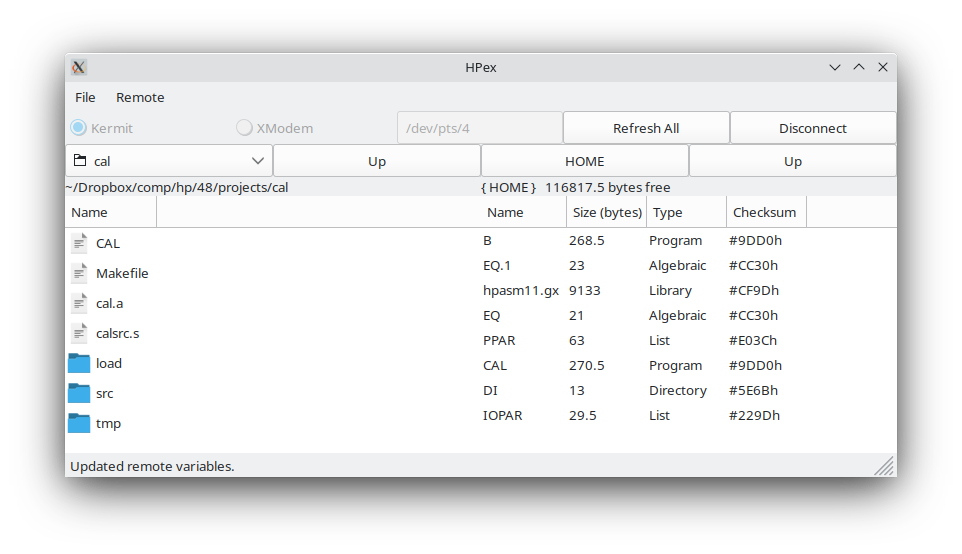

# hpex
A HP 48 to Linux transfer tool (pronounced "h-pecks", short for "HP
Exchange") with graphical and command line interfaces and features
found in no other Linux<->HP 48 transfer tool.

This is a manual describing most of HPex's features. I've tried to
make it as simple as possible, but watch out for things marked
**Important:**. These are pitfalls and possible areas of confusion.
# System Requirements

**Important:** HPex is designed to run on Linux. It will probably work
on Mac (though you should use Hoppi there), and I'm sure it won't work
on Windows.

Because the HP 48's main communication system is Kermit, you'll need
Kermit on your computer. I built HPex around C-Kermit 9.0, and it's
readily available in both binary and source forms at [Columbia's
Kermit site](http://www.columbia.edu/kermit/ck90.html#download). The
only other requirement that can't be installed through pip is
[wxPython](https://wxpython.org/). I'm not going to explain how to
install this, because it's highly distro-dependent---but if you're not
going to use the GUI part of HPex, you don't need it.

The other requirements are:

1. (xmodem)[https://pypi.org/project/xmodem/]
2. (PyPubSub)[https://pypi.org/project/PyPubSub/]
3. (ptyprocess)[https://pypi.org/project/ptyprocess/]
4. (pyserial)[https://pypi.org/project/pyserial/]

Install these with `sudo pip3 install xmodem PyPubSub ptyprocess
pyserial`. Or by hand, if you prefer.

Right now, HPex doesn't really install. It runs standalone from its
directory, and you could make `hpex.py` executable if you don't want
to type `python3` every time.

# Advantages over other tools
## HPTalx
HPTalx is the main other program that provides similar features to
HPex, and it has a number of shortcomings:

1. No XModem support
2. Lack of threading means HPTalx hangs
3. Old interface that doesn't match modern tools
4. Poor support for USB serial ports

## Raw Kermit
1. XModem support, but Kermit needs a lot of configuration to work with the HP 48
2. Command line interface but a lot of typing for a single file transfer
3. Also somewhat-old interface

That's not to say that HPex is perfect, but it suits me and it has a
lot of features nothing else has.

# Using HPex's GUI
When you start HPex without any arguments on the command line, it
launches into GUI mode. This interface is relatively intuitive, except
for one special thing I'll discuss in just a moment.

In the first row of widgets beneath the window, you'll see:
- the mode radiobuttons, which switch between Kermit and XModem
- the serial port box, which contains the port HPex is currently
  operating on
- the "Refresh All" and "Connect" buttons

Beneath there, you'll see four buttons:
- one that has the directory you started HPex from (this is actually a
  directory chooser)
- an "Up" button
- a pair of disabled "HOME" and "Up" buttons.

Then, there's a row with two labels, one that shows the same directory
as the chooser above it, and one that says "Not connected".

Finally, there are two listboxes (the one on the left has the files in
the directory above it), and a statusbox beneath those two.

## Finding a serial port
When you start HPex, it begins a search in `/dev` for serial ports it
can use, following these steps:

1. Look for any device files named `ttyUSB*`. If one is found, use that. If
   multiple are found, use the first one.
2. If no `ttyUSB` ports are found, then HPex searches for ports in
   `/dev/pts/`, the directory that holds pseudoterminals. `x48` uses
   device files in this directory for its serial ports, as does your
   terminal emulator (Konsole, xterm, and others). Files in this
   directory are device files named with numbers, and HPex looks for
   "empty spaces." For example:
   
   `/dev/pts/` contains five files: `0`, `1`, `2`, `3`, and `5`. The
   empty space is between `3` and `5`. HPex recognizes this, and uses
   `/dev/pts/4` as the serial port. Why? `x48`, the excellent Linux HP
   48 emulator, uses a protocol similar to this, and scanning for
   ports this way means HPex typically does a good job of finding the
   port that x48 will use.
   
   You'll notice this in the statusbar in the picture above. HPex
   tells you that it found `/dev/pts/4`, and also tells you to start
   `x48`. Sure enough, we start it, and...
   
   
   
   we clearly see that the emulator, sure enough, has chosen
   `/dev/pts/4` as the Wire serial port. **Make sure you start `x48`
   *after* starting HPex, otherwise HPex won't be able to find the
   empty space.**
   
3. Finally, if no empty spaces are found, the highest-numbered port is chosen.

The serial port box is just a standard entry box, and you can type any port you want to use.

## Transferring data with Kermit
Now that HPex has a valid serial port to use, we have to "connect" to
the HP 48 to the computer before we transfer any data. (This is an
idea inherited from HPTalx.) **Make sure the calculator is set to
translate mode 3.** If you don't do this, wxWidgets will crash with
Unicode errors.

Press connect, and a little dialog will come up informing you of
Kermit's ongoing process. Once it's finished, HPex should look like this:

Note that the widgets on the right side are no longer disabled, and
there's a lot more information. In the directory row, HPex tells you
what directory the calculator is currently in and how much memory is
in user memory (Port 0). In the picture, the calculator is in HOME,
with 145988.5 bytes free in Port 0.

Beneath that is a file list similar to the one on the left. Each
variable in the calculator's current directory is listed with its
name, size, type, and checksum.

#### Copying from the HP to the computer
Before you start, make sure both the calculator and the computer are
set to the right directory. The "HOME" button sets the calculator the
HOME directory, and "Up" is equivalent to running UPDIR on the
calculator.

To copy a variable from the calculator, start by double-clicking a
variable in the file listbox on the right. A window like this will
appear:

HPex tells you about the current connection and the file you want to
copy in this new window, which I'll call the "copy window". Kermit
will place the file in the directory specified on the left side of
HPex. 

Press "Copy" in the copy window to start. Unfortunately, the HP 48's
Kermit implementation doesn't send progress packets when it's sending
a file, so the progress indicator in the copy window just says "not
available when receiving". You can cancel with the "Cancel" button
when a copy operation is in progress.

If there's already a file with the name of the variable you're
copying, an dialog will appear asking what you want to do.

**Important:** to change directories on the calculator,
**single-click** a directory to select it (like 'TOOLS' in the above
example), and press one of Delete, Backspace, or Tab. HPex will change
directories and update the calculator's variable list. This is the
only part of HPex's interface that I feel isn't as intuitive as it
should be. In fact, it's only like this because you can't really work
with right-clicking an item in a listbox, which was my original
intent.

#### Copying from the computer to the HP
The steps for a Kermit copy are simple, similar to the previous
example. To change directories on the computer's side, you can do one of two things:

1. Double-click a directory (labeled with a folder icon) in the listbox.
2. Use the directory chooser above the box (next to the "Up" button) to choose any directory.
3. Press the "Up" button to move up one directory level.

Just like before, double-click on a file to open the copy
window. You'll see that there are significantly more options in the
window to send *to* the calculator:

Again, HPex informs you of the file and the port. However, it also
tries to identify whether the file you want to send is in HP ASCII
format (`%%HP: ...`) or HP binary format (`HPHP48-R`). If the file is
in ASCII format, like in the example above, HPex tells you the
translate mode it was sent in, the angle mode, and the fraction
mode. If the file is binary (see below), HPex finds the object
size---which includes the filename---and the checksum.

**Important:** while the code that generates the object checksum and
size is my own, the actual binary math and overall routine **IS NOT
MINE**. It's my C->Python conversion of version 2.52 of Jonathan
Higa's `TASC` program from Joe Horn's Goodies Disk #7. You can see the
modified C code from TASC in `ckfinder_old.c`.

Finally, let's finish copying the file. You can choose to make Kermit
rename the file on the calculator to something else, but by default,
HPex assumes you want no change and autofills the "Rename on
calculator:" box. When you start copying the file, the progress bar
fills until an error occurs or the copy finishes:

#### Transferring data with XModem
For the time being, XModem is only available as a send feature, i.e.,
you can only send files to the calculator and not vice versa. To
activate it, just click the "XModem" radiobutton. Make sure the port
you want to use is correct, choose a local directory, and double-click
a file you want to send. The copy window appears, this time without
the "Rename on calculator:" box, and you can start a
transfer. **Important:** using XModem mode with HPex is similar to
using XModem with Kermit in the terminal. You have to prepare the
calculator with a name in level 1 and be ready to press or type XRECV
before HPex times out, like this (the file we want to copy is 'TD2'):

Then, press "Copy" in the copy window. HPex tells you to run XRECV on
the calculator, and once you do, the progress bar will start filling
just like it does for a Kermit transfer.

## Settings

HPex is quite configurable, and the main way to do this is through the
Settings dialog, accessible through the File menu. The options are as
follows:

- **Startup directory:** the directory HPex will initialize the
  left-hand file list in this directory.
- **Baud rate:** this has the four options available on an HP 48, as
  well as 15360 and 115200 for compatibility with the HP 49 and 50.
- **Parity:** serial port parity, used by both XModem and Kermit.
- **Kermit file mode:** either Auto, Binary, or ASCII. I leave this in
  Auto and adjust the calculator to how I want files transferred, as
  Kermit seems very smart about figuring it out.
- **Kermit checksum mode:** 1, 2, or 3.

- **Disable pty search, look only for ttyUSB ports:** checking this
  box will prevent HPex from trying to load any ports from
  `/dev/pts/`. **Important:** If no ports are found, the serial port
  box will be empty.
- **Disconnect the calculator on close if connected:** this will
  finish the remote Kermit server if HPex is connected and you decide
  to close it.
- **Reset calculator directory on disconnect:** if this box is
  checked, HPex will remember the directory the calculator was set to
  *when it connected*, and will restore that directory on disconnect.
- **Ask to or warn about overwriting:** this box controls the
  generation of dialogs that warn you or let you control overwriting
  of files.

All settings are stored in the file `~/.hpexrc`. If you want to
restore the default settings, just delete this file.

## Extra features
The Local menu holds "Calculate checksum of object", which lets you
choose a file and get information about the HP object stored in it, if
one is present.

"Run Remote Command" in the Remote menu lets you run commands over
Kermit and see the results on the HP 48's stack.

## Errors
HPex is very robust to errors (one advantage over HPTalx!) and uses
short timeouts to keep a rapid response. When an error occurs, HPex
will make a little dialog explaining what happened (there are others,
but these are some examples):

All Kermit and XModem operations are threaded and use PyPubSub to
generate events within HPex, and I have actually never managed to make
HPex crash or hang because of a transfer error.

# Using HPex's CLI
I believe the most useful feature of HPex is the command-line
interface. It gives you pretty much all the options and features
available in the GUI but without the hassle of using it. I'm not going
to go very far in depth on the CLI, and you can find out more by
running `hpex.py` with `--help`.

The special things I want to note about the CLI are:
- It uses the same serial port scan technique as the GUI. I think this
  is both a good and a bad thing.
- Some options are ignored in one mode or another. HPex will tell you
  which ones it's ignoring, so that you can clean up your invocation.

The time I like to use the CLI is in a scenario like this: I'm working
on building some System RPL project and I want to run it on `x48` so
that I don't have to hook up my physical calculator. I can build the
project (I have Makefiles to simplify this) then run a simple command
to send the file to the emulator, like `./hpex.py -p /dev/pts/4 -d
CALENDAR`. It's much easier than prompting a new Kermit terminal every
time.
