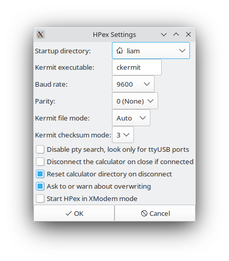

# hpex
HPex (pronounced "h-pecks", short for "HP Exchange") is a RPL HP
calculator to Linux transfer tool with graphical and command line
interfaces and features found in no other Linux<->HP transfer tool.

## Why is HPex better?
Just compare HPex to [HPTalx](http://hptalx.sourceforge.net/), a
popular application for the same purpose:

| Feature            | HPTalx                | HPex                                     |
|--------------------|-----------------------|------------------------------------------|
| remote commands    | yes                   | yes                                      |
| Kermit server      | yes                   | yes                                      |
| variable checksums | no                    | yes, and header processing               |
| XModem             | nope                  | send only                                |
| serial port        | confusing, outdated   | automatic port detection and x48 support |
| threading          | none, GUI hangs often | complete, GUI never hangs                |
| interface          | confusing, outdated   | modern, intuitive, and complete CLI      |

Furthermore, HPex is written in pure Python 3, using wxPython, which
abstracts GTK3 APIs, and is guaranteed to be up-to-date as new GUI
libraries emerge. This means that HPex can be maintained and upgraded
more or less indefinitely.

# System Requirements
**Important:** Although wxPython is cross-platform, HPex is designed
to run on Linux. Don't try to use it on another OS.

Also **important:** I don't currently own any of the Meta Kernel
calculators (the 49G, 49g+, 50g, and 48gII). As a result, consider
HPex unstable for use with these models. There's more info for the
curious at the bottom of this document.

## Software Requirements
- Python 3.9 or better
- C-Kermit 9.0

C-Kermit is readily available in both binary and source forms at
[Columbia's Kermit
site](http://www.columbia.edu/kermit/ck90.html#download), and probably
in your distro's package manager too.

- [wxPython](https://wxpython.org/) 4

If you don't want to use HPex's GUI and want to use only the
command-line interface, you don't need wxPython.

wxPython can be difficult to install. Some distros (including Arch
Linux) have it in the package manager. **This is the preferable
option.** For other distros, try looking on the wxPython website:
(https://wxpython.org/pages/downloads/). Look for a Python wheel file
for your distro.

If it is no package manager item or Python wheel, try installing via
with `pip` or by building the source tarball. Note that installing
with `pip` does not show progress information, while the source
tarball build does. wxPython is a large codebase and that progress
info is probably preferable.

The other requirements are:

1. [xmodem](https://pypi.org/project/xmodem/)
2. [PyPubSub](https://pypi.org/project/PyPubSub/) (note that this is different from [pubsub](https://pypi.org/project/pubsub/))
3. [ptyprocess](https://pypi.org/project/ptyprocess/)
4. [pyserial](https://pypi.org/project/pyserial/)

These can be installed in one shot with `sudo pip3 install xmodem
PyPubSub ptyprocess pyserial`.

To install HPex itself, make the `hpex.py` file executable, place the
whole directory in a convenient location, and add that directory to
your `$PATH`. HPex will run just fine. You can also rename `hpex.py`
to something else, like just `hpex`, if you prefer. I am looking into
perhaps making an AppImage distribution.

# Using HPex
When you start HPex without any arguments on the command line, it
launches into GUI mode.

The widgets beneath the menu bar are:

- the mode radiobuttons, which switch between Kermit and XModem
- the serial port box, which contains the port HPex is currently
  operating on
- the "Refresh All" and "Connect" buttons

Beneath that there are four more buttons:

- the current local directory: this button is actually a directory chooser
- an "Up" button
- a pair of disabled "HOME" and "Up" buttons.

Then, there's a row with two labels, one that shows the same directory
as the chooser above it, and one that says "Not connected".

Finally, there are two listboxes. The left listbox shows the files in
the current local directory, and the right listbox (which is empty on
startup) shows the files on the calculator when connected over Kermit.
A statusbox sits at the bottom of the window.

## Connecting to a calculator
Place your HP calculator in Kermit server mode, configure HPex's
serial port, and press Connect. HPex will fetch the current calculator
directory and variables in that directory and list them in the
right-hand listbox.

**Important:** make sure your calculator is in translate mode 3. If it
isn't, HPex will almost surely crash if there are any variables whose
names use the HP 48's extended ASCII.

## Finding a serial port
When you start HPex, it begins a search in `/dev` for potential serial
ports, following these steps:

1. Look for any device files named `ttyUSB*`, which is Linux's default
   device name for USB-to-serial adapters. Note that there is no
   support for [`ttyACM*`
   adapters](https://rfc1149.net/blog/2013/03/05/what-is-the-difference-between-devttyusbx-and-devttyacmx/).
   If HPex finds multiple `ttyUSB*` files, it uses the first one in
   alphanumeric order.
   
2. If no `ttyUSB` ports are found, then HPex searches for ports in
   `/dev/pts/`, the directory that holds pseudoterminal device
   files. `x48`, the excellent HP 48 emulator for Linux, creates
   device files in this directory for its serial ports, as does your
   terminal emulator (Konsole, `xterm`, and others). Files in this
   directory are device files named with numbers, and HPex looks for
   "empty spaces." For example:
   
   `/dev/pts/` contains three files: `0`, `1`, and `3`. The empty
   space is between `1` and `3`. HPex recognizes this, and chooses
   `/dev/pts/2` as the serial port. This is how `x48` searches for a
   pty to use.
   
   In this example, HPex will say that it found `/dev/pts/2`, and
   instruct you to start `x48`:
   
   
   
   we clearly see that the emulator, sure enough, has chosen
   `/dev/pts/2` as the Wire serial port. **Important:** Make sure you
   start `x48` *after* starting HPex, otherwise HPex won't be able to
   find the empty space.
   
3. Finally, if no empty spaces are found, HPex will find the highest
   `/dev/pts` port, then add one. For example, if the highest is
   `/dev/pts/3`, HPex will automatically use `/dev/pts/4`.
   
   
The serial port box is also just a standard entry box, and you can
type any port you want to use. The Refresh All button will rescan for
serial ports.

## Transferring files
To copy a file, simply drag and drop it from one window to
another. You can also press `Ctrl-S` to send the selected local file,
and `Ctrl-G` to get the selected remote file. Ctrl-G only works if
HPex is connected over Kermit. Note that you cannot drag a local
directory onto the calculator filebox, but you can copy a calculator
directory onto the computer.

You can send files with Kermit even if you aren't connected to the
calculator.

When you drop a file, a small dialog opens:

Press Cancel to cancel the file transfer operation. Remember that if
you're receiving a file from the calculator over Kermit, no progress
indication is sent to the computer.

## Settings

HPex is quite configurable, and the main way to do this is through the
Settings dialog, accessible through the File menu. The options are as
follows:

- **Startup directory:** the directory HPex will initialize the
  left-hand file list in this directory.
- **Kermit name:** the name for the Kermit executable. If installed
  from your distro's repository, this is probably `ckermit`, but if
  you built Kermit from source, it's probably `kermit`.
- **Baud rate:** this has the four options available on an HP 48, as
  well as 15360 and 115200 for compatibility with the HP 49 and 50.
- **Parity:** serial port parity, used by both XModem and Kermit.
- **Kermit file mode:** either Auto, Binary, or ASCII. I leave this in
  Auto and adjust the calculator to how I want files transferred, as
  Kermit seems very smart about figuring it out.
- **Kermit checksum mode:** 1, 2, or 3.
- **Disable pty search, look only for ttyUSB ports:** checking this
  box will prevent HPex from trying to load any ports from
  `/dev/pts/`, and look only for `/dev/ttyUSB*` ports. **Important:** If no
  ports are found, the serial port box will be empty and you will have
  to fill in a port yourself.
- **Disconnect the calculator on close if connected:** this will
  finish the remote Kermit server if HPex is connected and you decide
  to close it.
- **Reset calculator directory on disconnect:** if this box is
  checked, HPex will remember the directory the calculator was set to
  *when it connected*, and will restore that directory on disconnect.
- **Ask to or warn about overwriting:** this box controls the
  generation of dialogs that warn you or let you control overwriting
  of files.
- **Start HPex in XModem mode:** literally exactly what it sounds like

All settings are stored in the file `~/.hpexrc`. This file is not
human-editable, but it can be backed up and restored like any other
configuration file.

## Menus
In the File menu, you can send or receive, adjust settings, or
calculate info about an HP object on your computer.

In the Remote menu, if HPex is connected over Kermit, you can send
remote commands to the calculator.

## Errors
HPex is very robust to errors and uses short timeouts. When an error
occurs, HPex will inform you about what happened with a dialog like
this one:

All Kermit and XModem operations are threaded and use PyPubSub to
generate events within HPex. I have actually never managed to make
HPex crash or hang because of a transfer error.

# Using HPex's CLI
I believe the most useful feature of HPex is actually the command-line
interface. It gives you pretty much all the options and features
available in the GUI but without the hassle of navigating or using
it. I'm not going to go very far in depth on the CLI, as it's fully
documented with the `-h` or `--help` options.

The special things important to note about the CLI are:

- Some command-line options are ignored in certain modes. HPex will
  always inform you about what command-line options it ignores.
- It will load all the settings stored in `.hpexrc` and modify only
  the ones specified by you. For example, if you have parity set to
  odd and the Kermit checksum block set to 1 in `.hpexrc`, as set
  through the GUI, but specify `-r 0` in the invocation, HPex will use
  no parity but *will* use Kermit checksum mode 1.

**Important**: don't try to run just `hpex_cli.py` if you want to use
the CLI. You must use `hpex.py` for both the GUI and the CLI.

An example of when I like to use the CLI is in a scenario like this:
I'm working on some System RPL project, that I build with [Jonathan
Busby's excellent HP Tools patch](https://www.hpcalc.org/details/8971)
and I want to run it on `x48` so that I don't have to hook up my
physical calculator. I can build the project then run a simple command
to send the file to the emulator, like `python hpex.py -p /dev/pts/4
-d CALENDAR`. It's much easier than prompting a new Kermit terminal
every time.

# Troubleshooting
## CKermit lock errors
This section is for troubleshooting the error `/var/lock: Permission
denied`. 

Start by running `sudo chmod a+w /var/lock`. HPex always runs Kermit
under the user that ran HPex. If that user isn't superuser, Kermit may
not be able to access `/var/lock`. This `chmod` command will let
Kermit access `/var/lock`, however, this must be run at every
reboot. 

If that doesn't work, there are some other steps you can try. I have
found varying degrees of success with these, and I use just the
command above.

- Make sure you are in the `uucp` group on Arch, or the `dialout`
  group on Debian and related distros.
  
- Try setting root setgid on the `ckermit` executable with `sudo chmod
  g+s /usr/bin/ckermit`. This works because the lock file, `/var/lock`,
  is owned by `root`.

- Arch only: Change the executable's group to `uucp` (`sudo chgrp uucp
  /usr/bin/ckermit`), as recommended by the Kermit team
  [here](https://www.kermitproject.org/ckuins.html#x10) (scroll down
  from section 10 to "Even if you build the program...").

## "The command was not found or it was not executable:"
Make sure the Kermit executable name is set properly in Settings. It's
likely either `ckermit` or `kermit`, but you should check in a shell
to verify. Also, make sure the executable location is in your default
shell's global path, which is the only `$PATH` that HPex can access.

## "?Too many retries"
This is an error message generated by Kermit under many
circumstances. Check that all the settings are correct, on both the
calculator and the computer.

This message is also often accompanied by garbage text, like `9 I!
@-#Y3!^>J)0___B"U1@(`. This text comes from Kermit trying to use a
virtual terminal as its serial port while that terminal is in use for
a shell (i.e., Kermit tried to access `/dev/pts/3` but there's a
`bash` process already using that pty).

## "XModem couldn't write..."
This is like the above error, but generated by XModem. Again, check
all your settings, and make sure the calculator was ready to receive
the file you're trying to send.

## Why HPex will act weird with a MK calc
First off, Meta Kernel calcs with built-in USB might show up as
`/dev/ttyACM*` ports on modern kernels. This obviously needs to be
tested.

The Meta Kernel series added a bunch of new variable types. HPex uses
string processing to separate the columns from the output of `remote
directory` in Kermit, and the only way to separate columns is to split
each line by space (` `). The HP48 has two variable types that include
spaces: 'Global Name' and 'Real Number'. HPex recognizes these and can
work around them, but I don't know all the variable types on the MK
models.

I would also like to add support for the XModem server in the MK
series. I will eventually get a Meta Kernel calculator if I can find
one cheap enough.
